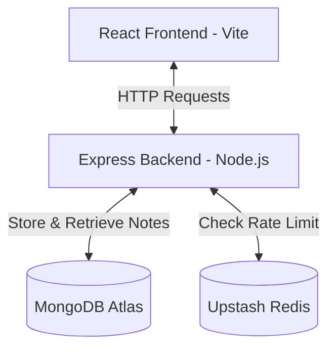

# ThinkBoard 📝

https://thinknotes-ssa9.onrender.com/

ThinkBoard is a premium, minimalist note-taking web application designed with a sleek glassmorphic dark-mode UI. It features a complete CRUD (Create, Read, Update, Delete) flow powered by a robust Express/MongoDB backend, and includes intelligent API rate-limiting via Upstash Redis to prevent spam.

The name and the theme of the project was inspired form my laptop ThinkPad

---

## 🛠️ Tech Stack

### Frontend
- **Framework:** React 19 (via Vite)
- **Routing:** React Router v7
- **Styling:** Tailwind CSS & DaisyUI
- **Icons:** Lucide React
- **HTTP Client:** Axios
- **Notifications:** React Hot Toast

### Backend
- **Runtime:** Node.js (ES Modules)
- **Framework:** Express.js
- **Database ORM:** Mongoose (MongoDB)
- **Rate Limiting:** Upstash Ratelimit & Upstash Redis
- **Dev Tooling:** Nodemon

---

## 🏗️ Architecture



---

## ✨ Features

- **Full CRUD Support:** Easily create, read, update, and delete notes.
- **Responsive Dark Design:** Styled with a modern radial gradient background (`#111` to `#BD0000`) and a glassmorphism feel.
- **Smart Rate Limiting:** Powered by Upstash sliding-window algorithm to throttle spam requests (configured to limit requests on a short window).
- **Toast Notifications:** Instant visual feedback for success/error events (creating, updating, deleting notes).
- **Dynamic API Routing:** Automated URL switching between local port `5001` in development mode and relative `/api` paths in production.

---

## 📂 Project Structure

```text
ThinkBoard/
├── backend/
│   ├── src/
│   │   ├── config/          # MongoDB and Upstash Redis configurations
│   │   │   ├── db.js
│   │   │   └── upstash.js
│   │   ├── controllers/     # Note-taking logic controllers
│   │   │   └── notesControllers.js
│   │   ├── middleware/      # Custom middleware (rate limiter)
│   │   │   └── rateLimiter.js
│   │   ├── models/          # Mongoose schema for Notes
│   │   │   └── Notes.js
│   │   ├── routes/          # Express router mappings
│   │   │   └── notesRouts.js
│   │   └── server.js        # Server entry point
│   ├── .env                 # Environment variables config
│   └── package.json
│
├── frontend/
│   ├── src/
│   │   ├── assets/
│   │   ├── components/      # UI components (Navbar, NoteCard, RateLimitedUI)
│   │   ├── lib/             # Axios instance and general helper functions
│   │   │   ├── axios.js
│   │   │   └── utils.js
│   │   ├── pages/           # Pages (HomePage, CreatePage, NoteDetailPage)
│   │   ├── App.jsx          # React routing wrapper
│   │   ├── index.css        # Global CSS + Tailwind styles
│   │   └── main.jsx         # App mounting point
│   ├── index.html
│   ├── tailwind.config.js
│   └── package.json
│
├── package.json             # Root orchestrator package.json
└── README.md
```

---

## ⚙️ Configuration & Setup

### 1. Prerequisites
Ensure you have the following installed:
- [Node.js](https://nodejs.org/) (v16+ recommended)
- A running [MongoDB Instance](https://www.mongodb.com/cloud/atlas) (or Local MongoDB Server)
- An [Upstash Redis](https://upstash.com/) database

### 2. Environment Variables
Create a `.env` file in the `backend/` directory and supply the following variables:

```ini
# Server Port
PORT=5001

# MongoDB Connection URI
MONGO_URI=your_mongodb_connection_string

# Upstash Redis Connection (for Rate Limiter)
UPSTASH_REDIS_REST_URL=your_upstash_redis_rest_url
UPSTASH_REDIS_REST_TOKEN=your_upstash_redis_rest_token

# Environment Mode
NODE_ENV=development
```

---

## 🚀 Running the Project

The project includes an orchestrator setup in the root directory to manage both frontend and backend tasks easily.

### Development Mode

Run the backend and frontend separately for hot-reloading:

1. **Start the Backend:**
   ```bash
   cd backend
   npm install
   npm run dev
   ```
   *The backend will run on `http://localhost:5001`.*

2. **Start the Frontend:**
   ```bash
   cd ../frontend
   npm install
   npm run dev
   ```
   *The frontend will run on `http://localhost:5173`.*

---

### Production Mode

In production, the backend serves the built React frontend files statically.

1. **Build and Install All Dependencies:**
   From the root folder, run:
   ```bash
   npm run build
   ```
   *This command installs dependencies in both directories and builds the frontend production bundle into `frontend/dist`.*

2. **Start the Production Server:**
   From the root folder, run:
   ```bash
   npm run start
   ```
   *The Express backend will start and host the application (server and static files) on the configured `PORT` (default: `5001`).*

---

## 🔌 API Documentation

All API endpoints are prefixed with `/api`.

| Method | Endpoint | Description | Request Body |
| :--- | :--- | :--- | :--- |
| **GET** | `/api/notes` | Retrieve all notes (sorted newest first) | *None* |
| **GET** | `/api/notes/:id` | Retrieve a specific note by ID | *None* |
| **POST** | `/api/notes` | Create a new note | `{ "title": "string", "content": "string" }` |
| **PUT** | `/api/notes/:id` | Update an existing note | `{ "title": "string", "content": "string" }` |
| **DELETE** | `/api/notes/:id`| Delete a note by ID | *None* |

### Rate Limiting Headers
When making requests, the Upstash Rate Limiter monitors your client IP/identifier. If the rate limit is exceeded, the server returns a `429 Too Many Requests` status code with the payload:
```json
{
  "message": "Too many requests, please try again later"
}
```
The frontend automatically intercepts `429` statuses to render a user-friendly rate-limit warning banner.

---

## 📝 License

Distributed under the ISC License. See `package.json` for details.
